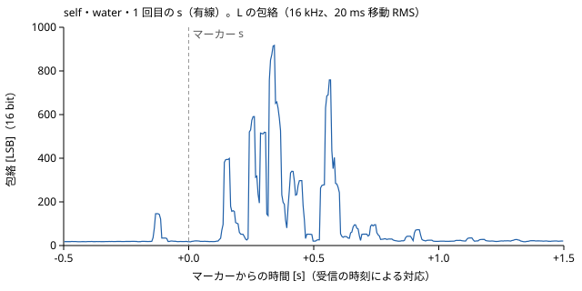

# 2026-10-08

この日の #37 の集計は docs/log/2026-10-07.md「#36 判定の条件（#37 の記録の前に固定）」の規則による（規則は変えていない）。

## やったこと

- #37 の有線の経路（`sh12jk-wired-unoq-usbaudio`）で 5 条件を録った（人）。記録は `data/raw/trial-throat/` の 6 フォルダ（1 本は中断）。NZ-210C 経由はまだ録っていない（変換ケーブル待ち）。
- 採否は人が数字（振幅の比）を見る前に決めた（10/8）。中断の 1 本を使わず、5 本を使う。
- `tools/throat_check.py` を 6 本に当て、使い捨ての集計 `~/work/zaitaku-mealpace-scratch/issue36/aggregate_throat.py` を有線の経路で 1 回だけ走らせた
  （`--path wired --quiet <quiet> --sessions <water> <cough> <neck> <talk>`）。出力の全文は貼らず、集計値を下に写す。スクリプトは直していない。
- `s` の 1 回分の包絡を SVG に描いた（下の「波形の切り出し」）。

## 分かったこと

- 有線の 5 本は overrun の行 0、段差 0、使わない目安に当たらない。叩きは 5 本とも 5 / 5 回見つかった。
- 叩きの `Δ` の中央値が 5 本とも −55〜−74 ms で、判断の 50 ms を超えた（音がマーカーより先に立ち上がる向き）。人の決定で、対応は直さず、表に印を付けて使う（下の「叩きの Δ」）。
- 判定の条件 1〜3 の値は下の「判定の条件に照らした結果」。**信号の有無の判定は人**。経路の差は NZ-210C 経由を録ってから。
- クロックの差（受信の時刻による対応の傾き）は −10.9〜−26.6 ppm で、10/7 の実測（180 秒、−8.1 ppm）より大きめに出た。原因は確かめていない。

## 次

- 人: NZ-210C 経由（`sh12jk-nz210c-rx-unoq-usbaudio`）の 5 条件を録る（変換ケーブル 2 本が届いてから。同じ手順、冒頭の叩き、記録の直後に `throat_check.py`、すぐに `data/raw/trial-throat/` へ移す）。
- エージェント: NZ-210C 経由の集計（同じスクリプトを 1 回）と、経路の差 `|s の比の中央値（NZ） − s の比の中央値（有線）| ÷ s の比の中央値（有線）` の計算（`--compare`）。
- 人: 信号の有無の判定（経路ごと）と経路の差の判定。

## #37 有線（`sh12jk-wired-unoq-usbaudio`）

Issue #37。被験者 `self`。UNO Q に挿した USB オーディオアダプタから `arecord` の生 PCM を ssh で PC に流す経路（docs/decisions/0028・0029）。
`meta.json` の装着の値は 6 本とも `position` = `midline-below-thyroid`、`band` = `elastic-25mm`、`firmware_sha` = `25af568`（PC 側の HEAD）。
ミキサーは 6 本とも `Mic Capture` 58（+4.00 dB、on）。

### 記録の表

`throat_check.py`（`--tap-mode enter`）の出力から写した。推定差は `meta.json` の値（到着から再計算した診断値を括弧に）。叩きの `Δ` に「印」とあるのは `|Δ の中央値|` > 50 ms。

| セッション | 条件 | 長さ（フレーム / 秒） | 終わり方 | マーカー | overrun の行 | 推定差（フレーム） | 段差 | 叩き 見つかった数 / `Δ` 中央値 | 使わない目安 | 採否と理由 |
|---|---|---|---|---|---|---|---|---|---|---|
| `20261008-203539_self_quiet` | `quiet` | 408,000 / 8.500 | **中断**（Ctrl-C、8.5 秒） | なし | 0 | −273（−288、−6 ms） | 0 | 0 / 0（叩きなし） | 当たらない（叩き 3 回未満の印） | **使わない**（中断。人の決定） |
| `20261008-203608_self_quiet` | `quiet` | 4,806,000 / 100.125 | 時間（`--duration`） | `o`（tap）5 | 0 | −499（−528、−11 ms） | 0 | 5 / 5、−55.2 ms（**印**） | 当たらない | 使う（`Δ` に印） |
| `20261008-203930_self_water` | `water` | 5,226,000 / 108.875 | Ctrl-C | `o`（tap）5、`s` 6 | 0 | −689（−720、−15 ms） | 0 | 5 / 5、−72.7 ms（**印**） | 当たらない | 使う（`Δ` に印） |
| `20261008-204146_self_cough` | `cough` | 3,978,000 / 82.875 | Ctrl-C | `o`（tap）5、`c` 6 | 0 | +164（+144、+3 ms） | 0 | 5 / 5、−66.2 ms（**印**） | 当たらない | 使う（`Δ` に印） |
| `20261008-204335_self_neck` | `neck` | 4,380,000 / 91.250 | Ctrl-C | `o`（tap）5、`n` 6 | 0 | −221（−240、−5 ms） | 0 | 5 / 5、−73.7 ms（**印**） | 当たらない | 使う（`Δ` に印） |
| `20261008-204532_self_talk` | `talk` | 3,930,000 / 81.875 | Ctrl-C | `o`（tap）5、`t` 6 | 0 | −301（−336、−7 ms） | 0 | 5 / 5、−70.9 ms（**印**） | 当たらない | 使う（`Δ` に印） |

- 録音の取りこぼし（overrun の行）は 6 本とも 0。
- 長さは Issue の目安（`quiet` 60 秒、`water` 120 秒、`cough`・`neck` 90 秒、`talk` 60 秒）と違う。`quiet` は 100 秒、ほかは人が Ctrl-C で止めた。どの本もマーカーは 6 回ずつそろっている。

時刻の対応と L / R（`throat_check.py`）:

| セッション | 到着の行 | `c0` | クロックの差 | 残差 中央値 / 95 パーセンタイル / 最大 | L と R の相関 / RMS の比（R / L） | 叩きの `Δ` 四分位範囲 / 最小 / 最大 |
|---|---|---|---|---|---|---|
| `203539_quiet`（中断） | 68 | −141.0 ms | 0（20 秒未満） | 8.0 / 17.0 / 52.0 ms | 1.000 / 1.000 | — |
| `203608_quiet` | 801 | −146.5 ms | −10.9 ppm | 8.7 / 20.4 / 42.7 ms | 1.000 / 1.000 | −59.9〜−34.4 / −76.5 / −32.5 ms |
| `203930_water` | 871 | −138.4 ms | −26.6 ppm | 8.4 / 28.7 / 173.8 ms | 1.000 / 1.000 | −75.8〜−64.0 / −113.3 / +50.3 ms |
| `204146_cough` | 663 | −132.0 ms | −11.8 ppm | 8.1 / 18.9 / 39.1 ms | 1.000 / 1.000 | −97.4〜−40.7 / −111.8 / +130.9 ms |
| `204335_neck` | 730 | −140.1 ms | −18.3 ppm | 8.5 / 19.5 / 71.3 ms | 1.000 / 1.000 | −153.0〜−48.4 / −208.7 / −33.9 ms |
| `204532_talk` | 655 | −140.2 ms | −22.5 ppm | 8.4 / 19.8 / 80.7 ms | 1.000 / 1.000 | −90.2〜−53.2 / −239.3 / −47.6 ms |

- L と R は 6 本とも相関 1.000、RMS の比 1.000（10/7 の実測と同じく、L と R は同じ値）。
- クロックの差は −10.9〜−26.6 ppm で、10/7 の実測（180 秒の連続受信、−8.1 ppm）より大きめに出た。記録の長さは 82〜109 秒。原因は確かめていない（推測しない）。
- `water` の残差の最大 173.8 ms は、到着の遅れ（下側の包絡からの上振れ）の 1 回。段差（区間の最小の差 50 ms 超）には当たっていない。

### 叩きの Δ が 50 ms を超えた件

- 5 本とも叩きは 5 / 5 回見つかったが、`Δ` の中央値が −55.2〜−73.7 ms で、判断の `|Δ の中央値|` ≤ 50 ms を外れた。向き（負。音の立ち上がりがマーカーの `t_ms` より前）と大きさは 5 本でそろっている。
  合成の確かめ（10/7。鍵盤の遅れ 3 ms で `Δ` −11 ms）から、包絡の窓による前への出方は 10 ms 程度で、残りの大半は Enter のキーが押されてから `record.py` が `t_ms` を取るまでの遅れと見られる（確かめていない）。
- 人の決定（10/8）: 規則のとおり `Δ` で対応を直さない。表に「`Δ` が 50 ms 超」の印を付けて使う。
- 判定の条件の窓（`(t, t + 1.5 s]`、`[t − 0.5 s, t + 1.5 s]`）の幅に比べると約 70 ms は小さいが、影響の大きさは測っていない。

### 集計の表（有線）

`aggregate_throat.py` の出力から写した。単位は LSB（L を 16 kHz に落とした値）。比と塊は使ったマーカーごとの値の中央値（四分位範囲）と最小・最大。

静止（`20261008-203608_self_quiet` の 16 kHz の値全体。冒頭の叩きを含む）:

| 項目 | 値 |
|---|---|
| 平均 / 標準偏差 | −0.27 / 1017.16 |
| 最小 / 最大 | −42455 / 39960 |
| 包絡 中央値 / 95 パーセンタイル / 最大 | 43.35 / 516.11 / 26134.40 |
| 条件 3 の「静止の中央値」（仮のマーカーの `[t − 2 s, t + 2 s]` を合わせた範囲の包絡の中央値） | 43.29 |
| L と R の相関 / RMS の比 | 1.000 / 1.000 |

ラベルごと:

| ラベル | マーカー | 使った | 除外（端 / 別のマーカー） | 振幅の比 中央値（IQR） | 比 最小 / 最大 | 塊の長さ 中央値（IQR） | 塊 最小 / 最大 | 基準の包絡の中央値（中央値） |
|---|---|---|---|---|---|---|---|---|
| `s` | 6 | 6 | 0 / 0 | 137.66（103.65〜193.95） | 48.42 / 235.02 | 258.2 ms（183.1〜356.7） | 164.1 / 508.5 ms | 18.50 |
| `c` | 6 | 6 | 0 / 0 | 405.35（334.12〜517.04） | 282.35 / 592.06 | 317.5 ms（309.9〜342.9） | 282.6 / 411.3 ms | 20.68 |
| `n` | 6 | 6 | 0 / 0 | 40.12（21.86〜45.52） | 11.35 / 54.04 | 1124.7 ms（989.9〜1231.0） | 42.8 / 1624.6 ms | 32.50 |
| `t` | 6 | 6 | 0 / 0 | 22.60（19.02〜24.22） | 17.31 / 36.71 | 380.9 ms（269.9〜543.6） | 144.4 / 728.1 ms | 24.24 |
| `quiet`（仮のマーカー） | 25 | 20 | 0 / 5 | 1.10（1.08〜1.44） | 1.06 / 62.63 | 18.2 ms（11.5〜24.5） | 0.0 / 235.1 ms | 43.32 |

- `c`・`n`・`t` との違いは数字を並べるだけにする（条件にしない。分けられるかは #40）。
- `quiet` の仮のマーカーの除外 5 は、冒頭の叩きの `o` の近く（別のマーカー）。比の最大 62.63 の 1 回が何によるかは見ていない。
- 基準の包絡の中央値は `quiet` のセッション（43.32）が `water`（18.50）・`cough`（20.68）・`talk`（24.24）・`neck`（32.50）より大きい。条件 3 のしきい（静止の中央値の 2 倍 = 86.6）は
  `quiet` のセッションから取る規則のとおり（規則は変えていない）。

帯域のエネルギーの割合（100〜4000 Hz の和に対する割合。条件にしない）:

| ラベル | 100〜500 Hz | 500〜1000 Hz | 1000〜2000 Hz | 2000〜4000 Hz |
|---|---|---|---|---|
| `s` | 0.029 | 0.112 | 0.326 | 0.533 |
| `c` | 0.152 | 0.058 | 0.274 | 0.516 |
| `n` | 0.034 | 0.021 | 0.116 | 0.829 |
| `t` | 0.894 | 0.046 | 0.017 | 0.043 |
| `quiet` | 0.131 | 0.126 | 0.223 | 0.520 |

### 判定の条件に照らした結果（有線）

| 条件 | 値 | 結果 |
|---|---|---|
| 1. `s` の振幅の比の中央値が 2 以上 | 137.66 | 満たす |
| 2. `s` の IQR が `quiet` の IQR と重ならない | `s` の第 1 四分位 103.65 > `quiet` の第 3 四分位 1.44 | 満たす |
| 3. 6 回の `s` のうち 5 回以上で `(t, t + 1.5 s]` に包絡 > 静止の中央値の 2 倍（86.6） | 使えた `s` 6 回ちょうど。6 回のうち 6 回 | 満たす |

- 3 つとも満たす（スクリプトの出力）。ただし 5 本とも叩きの `Δ` に印が付いている（上）。**信号の有無の判定は人**。
- 経路の差（20% 以内）は NZ-210C 経由を録ってから計算する。

「規則の外」の集計はしていない。

### 波形の切り出し

- `20261008-203930_self_water` の 1 回目の `s`（時刻の順で最初。選んでいない）の `[t − 0.5 s, t + 1.5 s]`（2 秒）。L を 16 kHz に落とし、集計と同じ包絡
  （`|x − 静止の中央値|` の 20 ms 中心の移動 RMS）を、描画のため 5 ms ごとの最大に間引いて描いた。横軸は受信の時刻による対応での `t` からの時間（叩きの `Δ` の印あり、直していない）。
- この 1 回の振幅の比は 48.42（6 回のうちの最小）、基準の包絡の中央値 18.94 LSB、最大 916.9 LSB。
- `self` の包絡（波形のサンプル値そのものではない）。描画の使い捨てのスクリプトはリポジトリに入れていない。
